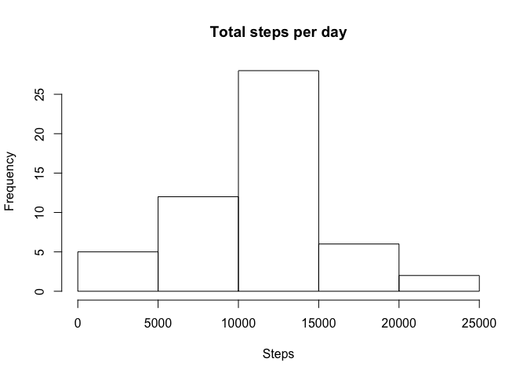
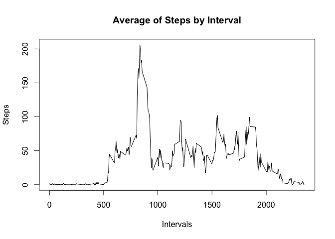
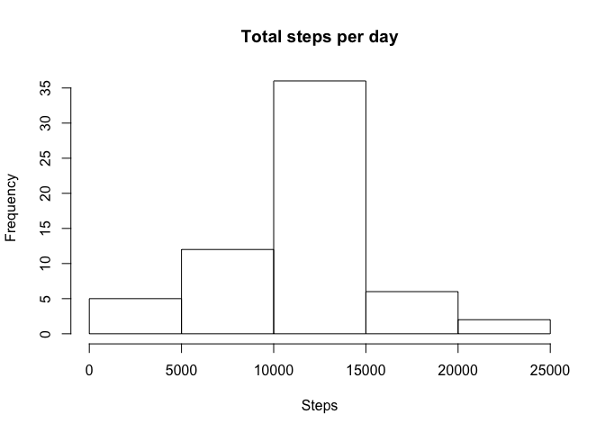
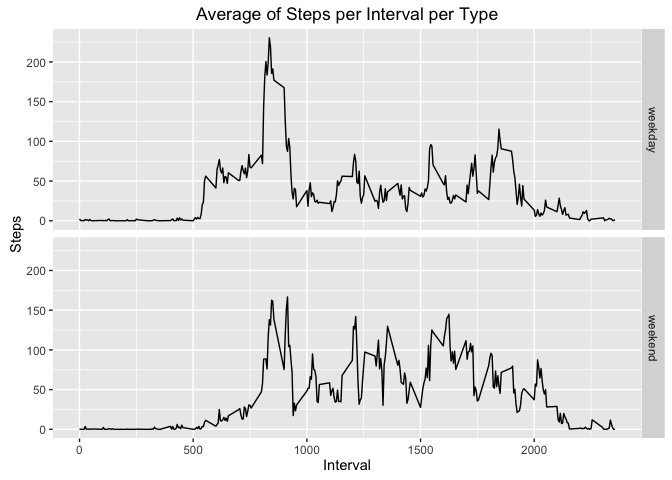

# Reproducible Research: Peer Assessment 1

## Introduction

This assignment makes use of data from a personal activity monitoring device. This device collects data at 5 minute intervals through out the day. The data consists of two months of data from an anonymous individual collected during the months of October and November, 2012 and include the number of steps taken in 5 minute intervals each day.

### Data

The data for this assignment can be downloaded from the course web site:

- Dataset: Activity monitoring data [https://d396qusza40orc.cloudfront.net/repdata%2Fdata%2Factivity.zip]

The variables included in this dataset are:

- steps: Number of steps taking in a 5-minute interval (missing values are coded as NA)

- date: The date on which the measurement was taken in YYYY-MM-DD format

- interval: Identifier for the 5-minute interval in which measurement was taken

The dataset is stored in a comma-separated-value (CSV) file and there are a total of 17,568 observations in this dataset.


## Loading and preprocessing the data

Initially, we will check to see if the file is present in working directory:


```r
if (!"activity.zip" %in% dir()) {
  stop("no data file found!")
}
```

So, we need to read the *activity.csv* file that is in *activity.zip* file.

Instead unzip the file, we will call the *read.csv()* function with the *unz* function. 

This will open the zip file, load the csv data and close the zip file. 


```r
activitys <- read.csv(unz("activity.zip", "activity.csv"), header=T, quote="\"", sep=",")
```

We can see the data that we loaded.


```r
str(activitys)
```

```
## 'data.frame':	17568 obs. of  3 variables:
##  $ steps   : int  NA NA NA NA NA NA NA NA NA NA ...
##  $ date    : Factor w/ 61 levels "2012-10-01","2012-10-02",..: 1 1 1 1 1 1 1 1 1 1 ...
##  $ interval: int  0 5 10 15 20 25 30 35 40 45 ...
```

We can see that the date column is of the type factor. So, lets convert than to a date type:


```r
activitys$date <- as.Date(activitys$date, format="%Y-%m-%d")
str(activitys)
```

```
## 'data.frame':	17568 obs. of  3 variables:
##  $ steps   : int  NA NA NA NA NA NA NA NA NA NA ...
##  $ date    : Date, format: "2012-10-01" "2012-10-01" ...
##  $ interval: int  0 5 10 15 20 25 30 35 40 45 ...
```

## What is mean total number of steps taken per day?

To calculate the mean total number of steps, first we will calculate the total number steps taken per day. We can use the *aggregate* function, so by default the missing values (NA) is ignored. 


```r
stepsPerDay <- aggregate(steps ~ date, sum, data=activitys)
```

We can view the frequency of steps per day, using a histogram:


```r
hist(stepsPerDay$steps, xlab ="Steps", ylab="Frequency", main="Total steps per day")
```



Now we can calculate the mean and median of the total number of steps per day:


```r
mean(stepsPerDay$steps, na.rm = TRUE)
```

```
## [1] 10766.19
```

```r
median(stepsPerDay$steps, na.rm = TRUE)
```

```
## [1] 10765
```

## What is the average daily activity pattern?

First, lets make a time series plot, using in x-axis all the intervals and in y-axis the steps.


```r
stepsInInterval <- aggregate(steps ~ interval, data = activitys, FUN = mean)
plot(stepsInInterval, type = "l", xlab="Intervals", ylab= "Steps", main="Average of Steps by Interval")
```



Ok. Now we can see in which interval we have the maximum number of steps on average:


```r
stepsInInterval$interval[which.max(stepsInInterval$steps)]
```

```
## [1] 835
```


## Imputing missing values

Lets take a look in missing values.

First, lets count how many rows have missing values:


```r
sum(is.na(activitys))
```

```
## [1] 2304
```

Now, we will replace the NA values with the mean of the interval that is missing. For example, if in row 5 the steps is NA and the interval is 25, we will mean the steps of the some interval for all days.

We will create a new database, named *activitys2* with the NA values changed.


```r
activitys2 <- activitys
index <- which(is.na(activitys2))
for (i in index) { 
  interval <- activitys2[i,][["interval"]]
  meanInterval <- mean(activitys2[activitys2$interval==interval & !is.na(activitys2$steps),][["steps"]])
  activitys2$steps[i] <- round(meanInterval)
}
```

Now let's make a histogram showing how the data will became.


```r
stepsPerDay2 <- aggregate(steps ~ date, sum, data=activitys2)
hist(stepsPerDay2$steps, xlab ="Steps", ylab="Frequency", main="Total steps per day")
```



Now we can calculate the mean and median of the total number of steps per day:


```r
mean(stepsPerDay2$steps)
```

```
## [1] 10765.64
```

```r
median(stepsPerDay2$steps)
```

```
## [1] 10762
```

So, we can compare the both histogram, mean and median with the old and new values.

We can see that a simple change in missing values make chances in the other values. So, the mean and median change only a little. But the pick in the histogram frequency chance from 25 to 35.

## Are there differences in activity patterns between weekdays and weekends?

Now, to know how is the diference between steps in weekend and weekdays, lets make a comparation.

First, we need to create a new column *type* that will contain the information about of type of weekdays it is.


```r
activitys2$type <- factor(c("weekend","weekday"))
```

And then, we process the dataset (those one without the missing values):


```r
weekend <- c("Sábado", "Domingo")
idx <- which( weekdays(activitys2$date) %in% weekend )
idx2 <- which( !weekdays(activitys2$date) %in% weekend )
activitys2[idx,][["type"]] <- "weekend"
activitys2[idx2,][["type"]] <- "weekday"
```

And now, we can generate a grafic per type. First, we generate a aggregate table. Then, we can plot the grafic. We are using two functions *ddply* and *qplot*, and need to use the *library* function.


```r
library(plyr)
library(ggplot2)
tbl<-ddply(activitys2, .(type,interval), summarize, total=mean(steps))
qplot(x=interval, y=total, data=tbl, facets = "type~.", geom = "line",xlab="Interval", ylab="Steps",main="Average of Steps per Interval per Type")
```


